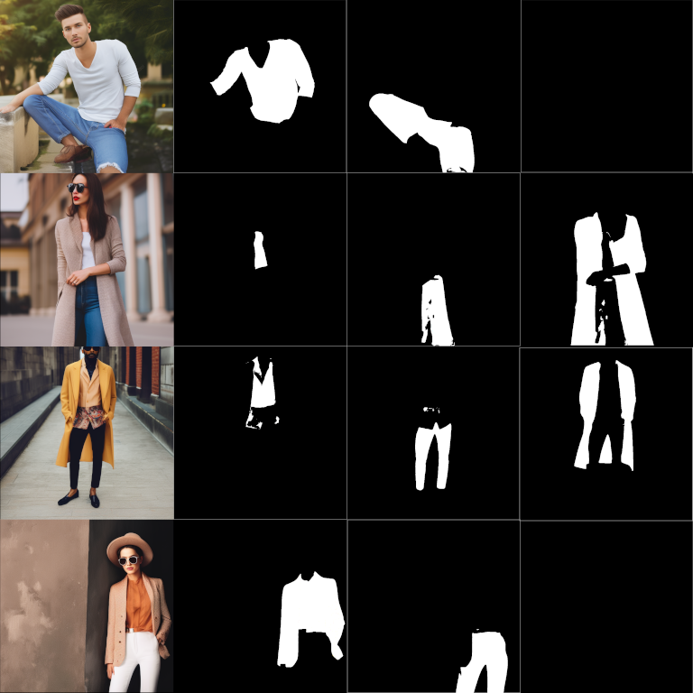
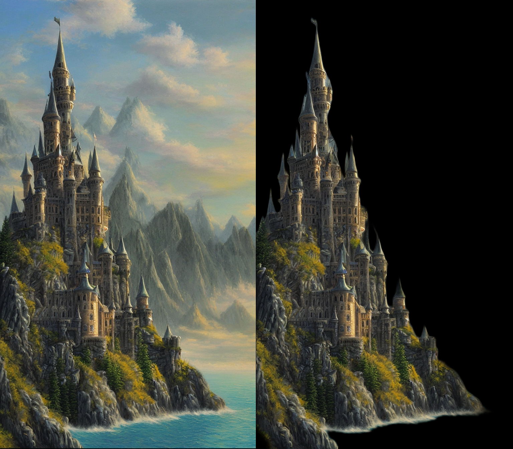
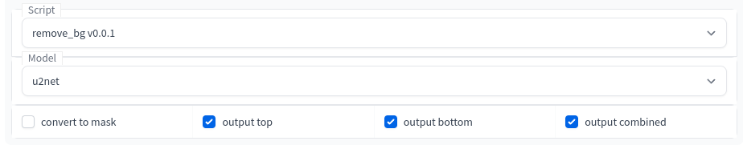

# Clothing Segmentation for auto1111
This is a wrapper of rem_bg for auto1111's stable diffusion gui. It can do clothing segmentation, background removal, and background masking.

## Examples

Clothing Masking (original, top, bottom, and combined)

Background Removal or Masks

Works on castles!

## Installation
It should be installable from the extensions tab.

You might need to seperately install [rem_bg](https://github.com/danielgatis/rembg)
`pip install rem_bg`

### Updating
In the WebUI, in the `Extensions` tab, in the `Installed` subtab, click `Check for Updates` and then `Apply and restart UI`.

## Usage
Select the "remove_bg vX.X.X" script from the script selection box in either txt2img or img2img.

### Models
`u2net_cloth_seg` output 3 images for the clothing categories top, bottom, and combined (unless any of the checkmark are unticked)

`u2net`, `u2netp`, `silueta` output images with the background removed.

`u2net_human_segmentation` removes background as well but is optimized for keeping humans. It tends to keep legs which are sometimes cut by the previous models.

## Clothing Segmentation
Clothing segmentation will only work for one person (if you want more people let me know, there might be a workaround). Clothing gets outputed as top, bottom, and combined. Combined represents fullbody length clothing.

## Very Useful Extensions
This extension works nicely with depth
https://github.com/thygate/stable-diffusion-webui-depthmap-script

## Updates

* v0.0.2
    *  examples/readme

## Acknowledgements/References
This is currently incomplete

Some code was used from Thygate's https://github.com/thygate/stable-diffusion-webui-depthmap-script

https://github.com/danielgatis/rembg

https://arxiv.org/pdf/2005.09007.pdf

https://github.com/NathanUA/U-2-Net

https://github.com/pymatting/pymatting
